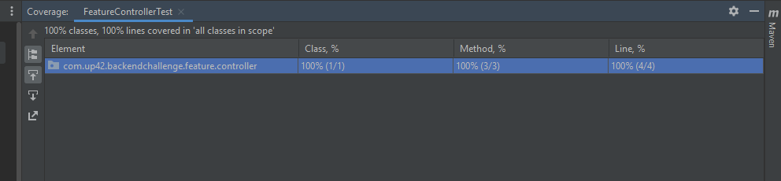

# up42-backend-challenge 

# Getting Started

### Guides
In this challenge lombok library tool to remove boilerplate code. You can follow the [link](https://www.baeldung.com/lombok-ide) to setup in Eclipse or in IntelliJ

### What Covered?
* Covered asked implementation for all three endpoints.
* Handled exceptions with Global Custom Exception Handlers 
* Covered 100% code coverage with all test cases passed (Attached screenshot).
* Used Swagger for documentation.
* Used legacy documentation in some places

